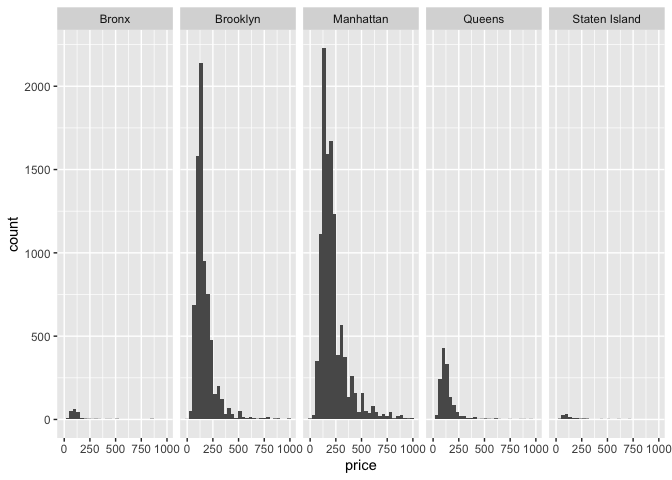

Airbnb
================
Yuki Joyama
2023-10-10

Import AirBnb data

``` r
library(tidyverse)
```

    ## ── Attaching core tidyverse packages ──────────────────────── tidyverse 2.0.0 ──
    ## ✔ dplyr     1.1.3     ✔ readr     2.1.4
    ## ✔ forcats   1.0.0     ✔ stringr   1.5.0
    ## ✔ ggplot2   3.4.3     ✔ tibble    3.2.1
    ## ✔ lubridate 1.9.2     ✔ tidyr     1.3.0
    ## ✔ purrr     1.0.2     
    ## ── Conflicts ────────────────────────────────────────── tidyverse_conflicts() ──
    ## ✖ dplyr::filter() masks stats::filter()
    ## ✖ dplyr::lag()    masks stats::lag()
    ## ℹ Use the conflicted package (<http://conflicted.r-lib.org/>) to force all conflicts to become errors

``` r
library(p8105.datasets)
library(ggridges)

data(nyc_airbnb)
```

- which hosts own many listings?

``` r
nyc_airbnb |> 
  group_by(host_id, host_name) |> 
  summarise(count = n()) |> 
  arrange(count) |> 
  tail()
```

    ## `summarise()` has grouped output by 'host_id'. You can override using the
    ## `.groups` argument.

    ## # A tibble: 6 × 3
    ## # Groups:   host_id [6]
    ##    host_id host_name        count
    ##      <dbl> <chr>            <int>
    ## 1   440022 Petter              18
    ## 2  8874674 Laura               18
    ## 3 81634538 Rio                 20
    ## 4   417504 Dana                28
    ## 5 51913826 The Bowery House    33
    ## 6 26377263 Stat                35

- the percentage of inactive listings (no review) among all

``` r
is.na(pull(nyc_airbnb, review_scores_location)) |> 
  sum()/nrow(nyc_airbnb)*100
```

    ## [1] 24.62886

- average price

``` r
nyc_airbnb |> 
  group_by(neighbourhood_group, room_type) |> 
  summarise(mean_price = mean(price)) |> 
  pivot_wider(
    names_from = room_type,
    values_from = mean_price
  )
```

    ## `summarise()` has grouped output by 'neighbourhood_group'. You can override
    ## using the `.groups` argument.

    ## # A tibble: 5 × 4
    ## # Groups:   neighbourhood_group [5]
    ##   neighbourhood_group `Entire home/apt` `Private room` `Shared room`
    ##   <chr>                           <dbl>          <dbl>         <dbl>
    ## 1 Bronx                            125.           65.5          57.5
    ## 2 Brooklyn                         175.           76.7          59.6
    ## 3 Manhattan                        238.          107.           84.7
    ## 4 Queens                           140.           70.6          49.1
    ## 5 Staten Island                    207.           65.4          25

``` r
nyc_airbnb |> 
  filter(price < 1000, room_type == "Entire home/apt") |> 
  ggplot(aes(x = price)) +
  geom_histogram() +
  facet_grid(.~ neighbourhood_group)
```

    ## `stat_bin()` using `bins = 30`. Pick better value with `binwidth`.

<!-- -->

``` r
nyc_airbnb |> 
  filter(price < 1000, room_type == "Entire home/apt", neighbourhood_group == "Manhattan") |>
  group_by(neighbourhood) |> 
  summarise(
    n_apt = n(),
    mean_price = mean(price)) |> 
  arrange(desc(mean_price)) 
```

    ## # A tibble: 32 × 3
    ##    neighbourhood      n_apt mean_price
    ##    <chr>              <int>      <dbl>
    ##  1 Tribeca              100       358.
    ##  2 NoHo                  61       312.
    ##  3 Flatiron District     75       307.
    ##  4 SoHo                 234       296.
    ##  5 Theater District      93       282.
    ##  6 Midtown              655       276.
    ##  7 Battery Park City     44       271.
    ##  8 Greenwich Village    282       256.
    ##  9 Chelsea              765       255.
    ## 10 Financial District   228       250.
    ## # ℹ 22 more rows

``` r
nyc_airbnb |> 
  filter(price < 1000, room_type == "Entire home/apt", neighbourhood_group == "Manhattan") |>
  mutate(neighbourhood = fct_reorder(neighbourhood, price)) |> 
  ggplot(aes(y = neighbourhood, x = price)) +
  geom_density_ridges()
```

    ## Picking joint bandwidth of 26.6

<!-- -->

# try to make a map
