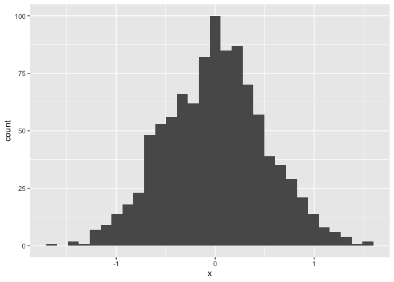
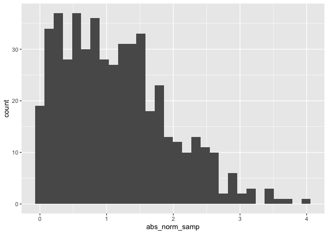

Simple document
================
Jeff
2023-09-12

I’m an R Markdown document!

# Section 1 First code chunk

Here’s a **code chunk** that samples from a *normal distribution*:

``` r
samp = rnorm(100)
length(samp)
```

    ## [1] 100

# Section 2 Make a plot

This code is borrowed from last lecture; it creates a dataframe for
plotting

``` r
plot_df = tibble(
  x = rnorm(1000, sd = .5),
  y = 1 + 2 * x + rnorm(1000)
)
```

Next up is a histogram of the `x` variable in `plot_df`.

``` r
ggplot(plot_df, aes(x = x)) + geom_histogram()
```

    ## `stat_bin()` using `bins = 30`. Pick better value with `binwidth`.

<!-- -->

# Section 3 Learning assessment

This code chunk should creates a dataframe comprised of: a numeric
variable containing a random sample of size 500 from a normal variable
with mean 1; a logical vector indicating whether each sampled value is
greater than zero; and a numeric vector containing the absolute value of
each element. Then, produce a histogram of the absolute value variable
just created. Add an inline summary giving the median value rounded to
two decimal places.

``` r
library(tidyverse)

la_df = tibble(
  norm_samp = rnorm(500, mean = 1),
  norm_samp_pos = norm_samp > 0,
  abs_norm_samp = abs(norm_samp)
)

ggplot(la_df, aes(x = abs_norm_samp)) + geom_histogram()
```

    ## `stat_bin()` using `bins = 30`. Pick better value with `binwidth`.

<!-- -->

``` r
median_samp = median(pull(la_df, norm_samp))
```

The median of the variable containing absolute values is 0.97.

# Section 4 Text formatting examples

## Text formatting

*italic* or *italic* **bold** or **bold** `code` superscript<sup>2</sup>
and subscript<sub>2</sub>

## Headings

# 1st Level Header

## 2nd Level Header

### 3rd Level Header

## Lists

- Bulleted list item 1

- Item 2

  - Item 2a

  - Item 2b

1.  Numbered list item 1

2.  Item 2. The numbers are incremented automatically in the output.

## Tables

| First Header | Second Header |
|--------------|---------------|
| Content Cell | Content Cell  |
| Content Cell | Content Cell  |
